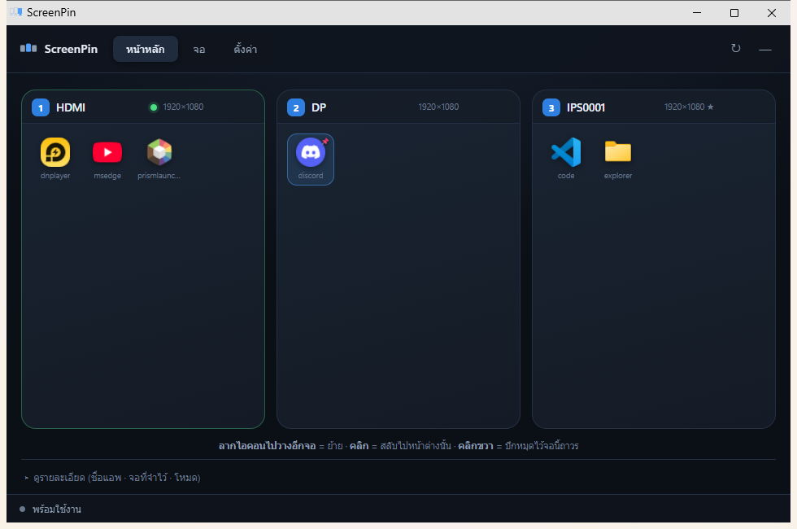
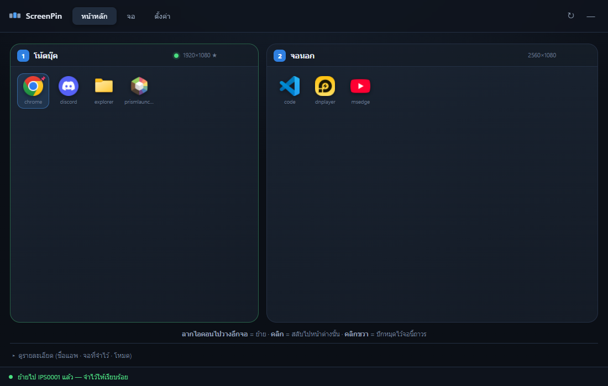
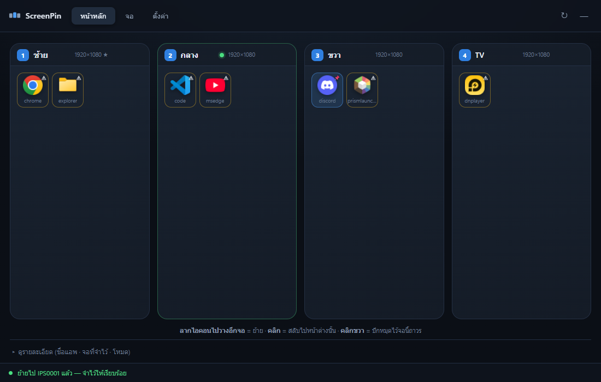
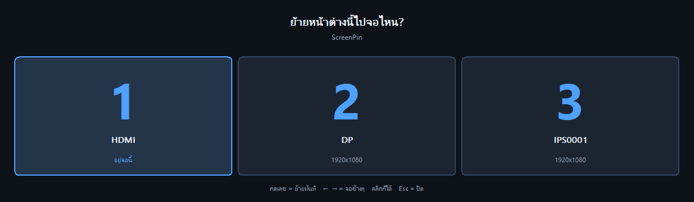
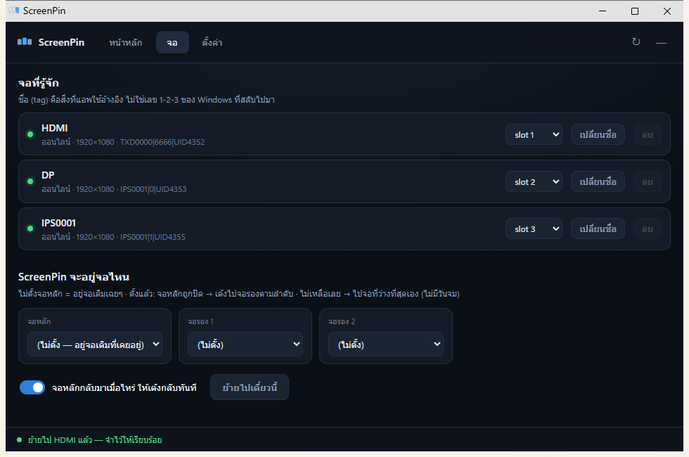
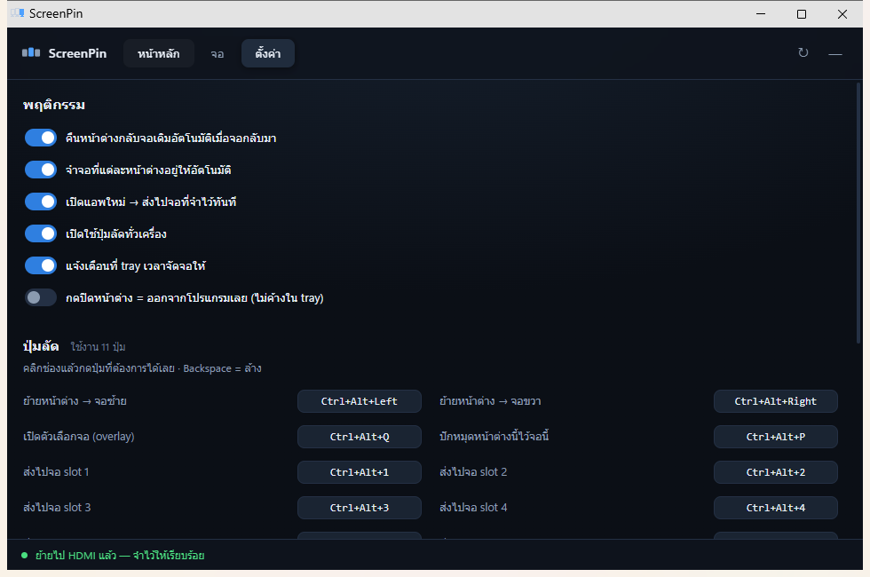

# ScreenPin

**ย้ายแอพข้ามจอด้วยการลากไอคอน — และจำได้ว่าแอพไหนอยู่จอไหน แม้จะปิด/เปิดจอ**

*Drag app icons between monitors, and it remembers where every window belongs —
even when you switch a monitor off and on. Windows 10/11, no dependencies.*



<details>
<summary><b>English</b> — what this is (click to expand)</summary>

A Windows window manager for people who switch monitors off and on. When a
monitor goes dark, Windows piles every window onto the remaining screens and
forgets where they came from — ScreenPin puts them back.

**How it works.** Windows renumbers displays (`1`, `2`, `3`) every time one is
switched off, so ScreenPin never uses that number. It builds a stable id out of
the panel itself — `<PnP id> | <EDID serial> | <connector UID>` — and you give
that a name (`left`, `desk`, `TV`). Everything else refers to the name, so it
survives replugging into a different port.

**Using it.** The main screen draws your monitors as cards with the real icons
of every window on them. Drag an icon to another card to move that window;
click to switch to it; right-click to pin it to that monitor for good.
Minimised windows show greyed out and can still be dragged. Global hotkeys
(`Ctrl+Alt+←/→/↑/↓`, `Ctrl+Alt+1-6`) move the focused window without opening
the app, and `Ctrl+Alt+Q` pops up a monitor picker you dismiss with one keypress.

**Memory.** Each window's monitor is remembered per-window for the session and
per-app in `config.json`, and positions are stored as fractions of the work area
so they survive a change of resolution. Three guards stop the memory going bad:
a window shoved elsewhere while its home monitor is dark is not relearned,
neither is one you deliberately evacuated before switching a monitor off, and an
explicit move through the app always wins.

**Install.** Grab `ScreenPin.exe` from [Releases](../../releases) — one 8 MB
file, no installer, no Python needed. It only needs Microsoft Edge (or Chrome),
which it uses purely as a renderer for the interface; the app itself is Python
talking to the Win32 API through `ctypes`, with no pip dependencies at all.
Works with 1 to 8 monitors in any arrangement, side by side or stacked.

MIT licensed — do what you like with it.

</details>

สำหรับคนใช้หลายจอที่ต้อง **ปิดจอบางตัวบ่อยๆ** — พอปิดจอ Windows จะยัดหน้าต่างมารวมกัน
พอเปิดจอกลับมาก็ต้องมานั่งลากคืนเองทีละอัน ScreenPin จำให้แล้วคืนให้เอง

---

## ทำอะไรได้

| | |
|---|---|
| 🖱 **ลากไอคอนข้ามจอ** | ไม่ต้องอ่านชื่อ เห็นไอคอนจริงของแอพ ลากไปวางอีกจอ = ย้าย |
| 🧠 **จำจอของทุกหน้าต่าง** | ปิดจอ → เปิดจอ → คืนที่เดิมพร้อมขนาด/ตำแหน่งเดิมอัตโนมัติ |
| 📌 **ปักหมุด** | ล็อกแอพไว้จอนั้นถาวร เปิดใหม่กี่รอบก็ไปจอนั้น |
| ⌨ **ปุ่มลัดทั่วเครื่อง** | `Ctrl+Alt+←/→` ย้ายหน้าต่างที่ใช้อยู่ · `Ctrl+Alt+1-4` เจาะจงจอ |
| 🎯 **ตัวเลือกจอ** | `Ctrl+Alt+Q` แผนที่จอโผล่กลางจอ กดเลขเดียวจบ |
| 🚚 **อพยพทั้งจอ** | ก่อนปิดจอ กดปุ่มเดียวย้ายออกหมด แต่ยังจำจอเดิมไว้ |
| 🖥 **ตัวแอพเองก็เด้งตามจอ** | ตั้งจอหลัก/จอรองได้ จอหลักกลับมาเมื่อไหร่เด้งกลับทันที |

รองรับ **1–8 จอ** ความละเอียดต่างกันได้ วางเรียงแนวนอน ซ้อนแนวตั้ง หรือเป็นตารางก็ได้:

| 2 จอ | 4 จอ |
|---|---|
|  |  |

---

## ติดตั้ง

1. โหลด **`ScreenPin.exe`** จาก [Releases](../../releases) — ไฟล์เดียว ~8 MB
2. วางไว้โฟลเดอร์ไหนก็ได้ แล้วดับเบิลคลิก
3. แท็บ **ตั้งค่า → ใส่ไว้ใน Start menu** → กด Start พิมพ์ `ScreenPin` เปิดได้เลย
   (pin ไป taskbar ได้ด้วย)

**ไม่ต้องลง Python ไม่ต้องลงอะไรเลย** ขอแค่มี Microsoft Edge (ติดมากับ Windows 11 อยู่แล้ว)
เพราะใช้ Edge เป็นตัว render หน้าตา

> รันจาก source ก็ได้: ต้องมี Python 3.10+ แล้วดับเบิลคลิก `ScreenPin.vbs`
> — **ไม่ต้อง pip install อะไรทั้งนั้น** ใช้ Win32 ผ่าน ctypes ล้วน

### ปิดยังไง

| ทำ | ผล |
|---|---|
| กด **X** | หน้าต่างปิด แต่ยังคอยจัดจอให้ใน tray (คลิกไอคอน tray เปิดกลับ) |
| tray → คลิกขวา → **ออก** | ปิดสนิท |

อยากให้กด X แล้วปิดสนิทไปเลย: ติ๊ก *ตั้งค่า → กดปิดหน้าต่าง = ออกจากโปรแกรมเลย*
อยากให้เปิดเองตอนบูต: ติ๊ก *ตั้งค่า → เปิดเองพร้อม Windows* (default ปิดอยู่)

---

## ใช้ยังไง

**หน้าหลัก** = จอทุกตัวเรียงตามตำแหน่งจริง แต่ละจอมีไอคอนแอพที่อยู่บนจอนั้น

- **ลากไอคอน** ไปวางอีกจอ → ย้ายทันที + จำไว้ให้
- **คลิกไอคอน** → สลับไปหน้าต่างนั้น
- **คลิกขวาไอคอน** → ปักหมุดไว้จอนี้ถาวร (มี 📌 ขึ้น)
- **คลิกชื่อจอ** → เปลี่ยนชื่อ
- ⚠ บนไอคอน = หน้าต่างนี้ไม่ได้อยู่จอที่จำไว้
- **แอพที่ย่ออยู่** ขึ้นเป็นไอคอนสีเทา + ▾ — ลากย้ายได้ทั้งที่ยังย่อ คลิกเพื่อเรียกขึ้นมา

### ปุ่มลัด (เปลี่ยนได้ในตั้งค่า)

| ปุ่ม | ทำอะไร |
|---|---|
| `Ctrl+Alt+←` / `→` | ย้ายหน้าต่างที่ใช้อยู่ไปจอซ้าย/ขวา |
| `Ctrl+Alt+↑` / `↓` | ย้ายไปจอบน/ล่าง (ถ้าวางจอซ้อนกัน) |
| `Ctrl+Alt+1…4` | ส่งไปจอ slot นั้น |
| `Ctrl+Alt+Q` | เปิดตัวเลือกจอ แล้วกดเลข |
| `Ctrl+Alt+Shift+←/→` | อพยพทุกหน้าต่างบนจอนี้ |
| `Ctrl+Alt+P` | ปักหมุดหน้าต่างนี้ |
| `Ctrl+Alt+M` | เปิดหน้าต่าง ScreenPin |



---

## จำจอได้ยังไง

Windows สลับเลขจอ `1-2-3` ไปมาทุกครั้งที่ปิด/เปิดจอ → ใช้เลขอ้างอิงไม่ได้
ScreenPin เลยสร้าง **ID ถาวรจากตัวจอจริง**:

```
<PnP ID> | <EDID serial> | <UID พอร์ต>      เช่น  IPS0001|1|UID4355
```

แล้วให้ตั้ง **ชื่อ (tag)** ทับ เช่น `ซ้าย` `กลาง` `TV` — ทุกอย่างในแอพอ้างชื่อนี้
ย้ายสายไปพอร์ตอื่นก็ยังจับคู่ถูก (ใช้ระบบให้คะแนนความเหมือน)



### ความจำมี 2 ชั้น

| ชั้น | ขอบเขต | ใช้ตอน |
|---|---|---|
| session | ต่อ**หน้าต่าง** | Chrome 3 หน้าต่างคนละจอ จำแยกกันได้ |
| config | ต่อ**แอพ** | เปิดแอพใหม่ / รีสตาร์ทเครื่อง |

ลำดับ: `ปักหมุด` > session > config

### กันความจำเพี้ยน

- จอที่จำไว้**ถูกปิดอยู่** → Windows ยัดหน้าต่างไปจออื่น แอพ**ไม่**จำทับ
- **อพยพเอง**ก่อนปิดจอ → ก็ไม่จำทับ (ถือว่าย้ายชั่วคราว)
- **ย้ายเอง**ผ่านแอพ/ปุ่มลัด → จำทันที (ถือว่าตั้งใจ)

ตำแหน่ง/ขนาดเก็บเป็น **สัดส่วนของ work area** ไม่ใช่ pixel → ข้ามจอคนละความละเอียดก็ไม่เพี้ยน
และ clamp ให้อยู่ในจอเสมอ **ไม่มีวันจมนอกจอ**

---

## ตัวแอพเองอยู่จอไหน

- **ไม่ตั้ง** = อยู่จอเดิมที่เคยอยู่ (จอนั้นหายค่อยย้ายให้)
- **ตั้งจอหลัก + จอรอง 1/2** = จอหลักปิด → เด้งไปจอรองตามลำดับ
  → ไม่เหลือเลย → ไปจอที่ว่างที่สุดเอง
- **จอหลักกลับมา → เด้งกลับทันที**

---

## ตั้งค่า



---

## ทำด้วยอะไร

| ส่วน | ใช้ |
|---|---|
| แกนหลัก | Python 3 + Win32 API ผ่าน `ctypes` ล้วน — **0 dependency** |
| หน้าตา | HTML/CSS/JS เสิร์ฟจาก `http.server` บน `127.0.0.1` แล้วเปิดด้วย `msedge --app` |
| ไอคอนแอพ | ดึง HICON จากหน้าต่างจริง แปลงเป็น PNG เอง (zlib + struct) |
| overlay | วาดด้วย GDI ตรงๆ (โผล่ทันที ไม่ต้องรอเบราว์เซอร์) |
| tray + hotkey | `Shell_NotifyIconW` + `RegisterHotKey` |
| .exe | PyInstaller (onefile ~8 MB) |

เซิร์ฟเวอร์ผูกกับ `127.0.0.1` เท่านั้น + ต้องมี token ใน URL — เครื่องอื่นเข้าไม่ได้

### Build เอง

```
pip install pyinstaller
build.bat
```

### เทส

ปิดแอพก่อน (ไม่งั้นมันจะแย่งย้ายหน้าต่างกับเทส) แล้ว:

```
python tests\run_all.py
```

เทสจำลองปิด/เปิดจอด้วยหน้าต่างจริง แล้วเช็คว่าคืนที่เดิมจริง —
ครอบคลุม: คืนจอหลังปิด-เปิดจอ · หลายหน้าต่างต่อแอพ · อพยพก่อนปิดจอ · chain จอของตัวแอพ

---

## ข้อจำกัด

| เรื่อง | ทำไม | ทางแก้ |
|---|---|---|
| ย้ายแอพที่รันเป็น Admin ไม่ได้ | Windows บล็อก (UIPI) | รัน ScreenPin as Admin ด้วย |
| เกม fullscreen แบบ exclusive ย้ายไม่ได้ | ไม่ใช่หน้าต่างปกติ | ตั้งเกมเป็น borderless |
| ต้องมี Edge หรือ Chrome | ใช้เป็นตัว render หน้าตา | Windows 11 มีอยู่แล้ว |
| Task Manager เห็น `msedge.exe` เพิ่มตอนเปิดหน้าต่าง | ตัว render | ปิดหน้าต่างแล้วหายไป เหลือแต่ ScreenPin |

> ไอคอนบน **taskbar / title bar / Task Manager** เป็นของ ScreenPin ทั้งหมด
> (ตั้ง AppUserModelID + RelaunchIconResource ให้หน้าต่าง ไม่งั้นจะขึ้นเป็นไอคอน Edge)

---

## ไฟล์

```
ScreenPin.exe        ตัวแอพ (build จาก build.bat)
ScreenPin.vbs        เปิดจาก source แบบไม่มี console
run-debug.bat        เปิดจาก source แบบเห็น log
main.py              จุดเริ่ม (--tray = เริ่มแบบย่อลง tray)
config.json          ค่าทั้งหมด สร้างเอง แก้มือได้
screenpin/
  win32.py     ctypes ทั้งหมด
  monitors.py  ระบุจอ + EDID + จับคู่จอ
  windows.py   หา/ย้ายหน้าต่าง
  icons.py     ดึงไอคอนแอพ -> PNG
  engine.py    ตรรกะจำจอ + คืนจอ
  msgloop.py   thread: hotkey + tray + WM_DISPLAYCHANGE
  picker.py    overlay เลือกจอ (GDI)
  server.py    HTTP API ภายในเครื่อง
  browser.py   คุมหน้าต่าง Edge
  shortcut.py  สร้าง .lnk ผ่าน IShellLinkW (รองรับ path ภาษาไทย)
  taskbar.py   ตั้ง AppUserModelID + ไอคอน ให้ taskbar เป็น ScreenPin ไม่ใช่ Edge
  app.py       ตัวคุมทั้งหมด
  web/         หน้าตา
tests/               เทสพฤติกรรมจริง
```

ดู [PLAN.md](PLAN.md) สำหรับเหตุผลการออกแบบและปัญหาที่เจอระหว่างทำ ·
[CHANGELOG.md](CHANGELOG.md) สำหรับสิ่งที่เปลี่ยนในแต่ละเวอร์ชัน
